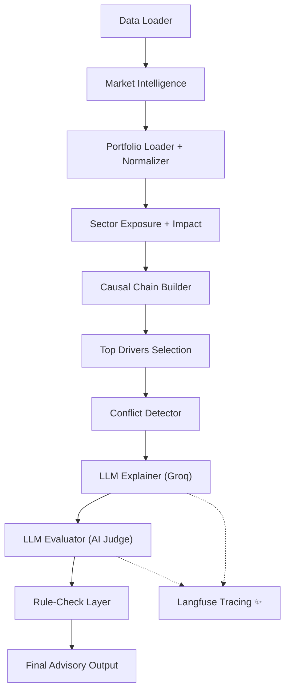

# AlphaTrace — Full Session Audit

## Executive Summary

This session transformed AlphaTrace from a functional but noisy financial reasoning prototype into a **polished, production-grade intelligence system** with hedge-fund-quality output and full observability.

---

## System Architecture



---

## Commit History (This Session)

| Commit | Description | Scope |
|--------|-------------|-------|
| `93a714c` | Optimized output constraints | Deduplication, grouped sector logic |
| `dd98c24` | Executive styling | Pct formatting, risk wording |
| `816ae0e` | Finalize standards | Phrase pools, Title Case |
| `ea23596` | Causal depth restoration | Unique triggers, apostrophe ban |
| `176f8f1` | Robustness + Logging | CLI interface, JSONL logs, missing data guards |
| *(pending)* | Langfuse Observability | LLM tracing, latency, token tracking |

---

## Detailed Audit of Enhancements

### 1. 🚀 CLI Interface & Robustness (`main.py`)
- **CLI Argparse**: Run specific portfolios via `python main.py --portfolio PORTFOLIO_001`. Use `all` to run the full set.
- **Resilient Pipeline**: Added guards for missing news data (falls back to quantitative reasoning) and invalid portfolio IDs.
- **Structured Logging**: Every run appends a JSON record to `logs/pipeline.jsonl` capturing metrics, drivers, and scores for later auditing.

### 2. 👁️ Langfuse Observability
- **LLM Tracing**: Wrapped `llm_explainer` and `llm_evaluator` with Langfuse generators.
- **Metric Collection**: Captures input/output payloads, exact latency, and token usage per call.
- **Attribution**: Metadata includes `portfolio_id` and `stage` (explanation/evaluation) for easy filtering in the dashboard.
- **Fail-Safe**: All tracing logic is wrapped in `try-except` blocks; the reasoning engine remains fully functional even if the observation endpoint is unreachable.

### 3. ✅ Deterministic Rule-Check Layer
- SCANNING summary for sectors, stocks, and causal keywords (e.g. RBI, inflation).
- HYBRID score: AI Judge score is boosted (+2 max) by deterministic completeness check.

---

## Final Output Showcase

```
────────────────────────────────────────────────────────────
 📊 PORTFOLIO_002 | Priya Patel | Sector_Concentrated
────────────────────────────────────────────────────────────

[FINAL ADVISORY EXPLANATION]
 Portfolio declined by 2.73%. Banking holdings contributed -1.84%,
 primarily driven by HDFCBANK, as hawkish RBI stance pressured
 lending outlook. Uncertainty remains regarding the diverging paths
 of Banking and Financial Services stocks, posing risk to
 overall portfolio stability.

  Top Drivers:
  - Banking holdings contributed -1.84%, primarily driven by
    HDFCBANK, as hawkish RBI stance pressured lending outlook
  - Financial Services holdings contributed -0.37%, primarily
    driven by BAJFINANCE, as tight liquidity conditions weighed
    on NBFCs

  [AI JUDGE SCORE]    10.0 / 10
  [RULE CHECK]        Sector: ✔ | Stock: ✔ | Cause: ✔
```
