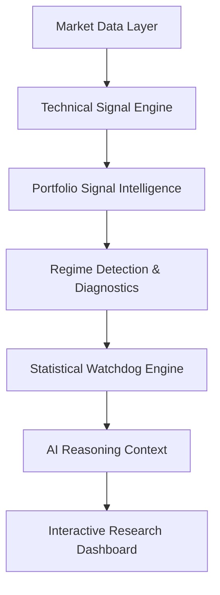

# 📊 AlphaTrace: Quantitative Intelligence Research Workbench

AlphaTrace is a professional-grade quantitative intelligence platform designed for strategy research, market regime detection, and operational health monitoring. It transforms raw market data into structured, actionable research intelligence using a deterministic, interpretability-first architecture.

## 🚀 Core Architecture

AlphaTrace follows a layered intelligence philosophy where quantitative rigor grounds AI reasoning.



## 🛠️ Key Frameworks

### 🎯 Signal Intelligence
Deterministic, triple-confirmation signals (RSI/MACD/BB) with bounded confidence scores and causal explanations.
*   *Documentation*: [Signals Schema](docs/signals_schema.md)

### 🚨 Statistical Watchdog
Institutional-grade health monitoring detecting Sharpe decay, structural distribution shifts (KS-Test), and acute anomalies (Z-Score).
*   *Documentation*: [Watchdog Framework](docs/watchdog_framework.md)

### 🏢 Portfolio Intelligence
Cross-asset signal ranking, market bias classification, and sector conviction clustering to surface concentrated opportunities.
*   *Documentation*: [Portfolio Intelligence](docs/portfolio_intelligence.md)

### 🤖 AI Reasoning
A context-aware synthesis layer that fuses regimes, watchdog alerts, and signal intelligence to provide grounded research guidance.
*   *Documentation*: [Reasoning Architecture](docs/reasoning_architecture.md)

## ⚖️ Research Philosophy

AlphaTrace is built on the principle of **Deterministic Integrity**:
*   **Interpretability > Prediction**: Every output is mathematically traceable.
*   **Contextual Awareness**: Intelligence is always framed by market regimes and operational health.
*   **No Black-Boxes**: We avoid opaque ML models in favor of auditable quantitative logic.
*   **Operational Intelligence**: Focus on the "Now" and strategy health, not speculative forecasting.

## 📋 Getting Started

### Installation
```bash
pip install -r requirements.txt
```

### Run the Research Dashboard
```bash
streamlit run run_app.py
```

### Run Verification Suite
AlphaTrace includes a comprehensive deterministic verification suite:
```bash
python3 scratch/verify_signal_generator.py
python3 scratch/verify_watchdog.py
python3 scratch/verify_portfolio_signals.py
```

## 🛡️ Known Limitations
*   No transaction-cost or slippage modeling.
*   Static signal thresholds (not regime-adaptive).
*   No autonomous execution or broker integration.
*   Single timeframe (Daily) analysis.

---
*AlphaTrace is a research infrastructure tool. Past performance is not indicative of future results.*
