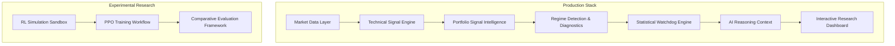

# 📊 AlphaTrace: Quantitative Intelligence Research Workbench

AlphaTrace is a professional-grade quantitative intelligence platform designed for strategy research, market regime detection, and operational health monitoring. It transforms raw market data into structured, actionable research intelligence using a deterministic, interpretability-first architecture.

## 🚀 Architecture Overview

AlphaTrace follows a layered intelligence philosophy where quantitative rigor grounds AI reasoning.



## 🛠️ Feature Map

*   **🎯 Live Signal Intelligence**: Surfacing actionable opportunities with causal reasoning across multi-asset portfolios.
*   **🚨 Statistical Watchdog**: Operational monitoring for Sharpe decay, structural shifts (KS-Test), and acute anomalies (Z-Score).
*   **📈 Market Regime Awareness**: HMM-based regime detection (Bull/Bear/Sideways) with persistence tracking.
*   **🤖 Proactive Reasoning**: A context-aware AI assistant grounded in pre-calculated quantitative fact.
*   **🧪 RL Research Sandbox**: Isolated environment for training and evaluating PPO agents against deterministic baselines.

## ⚖️ Research Philosophy

AlphaTrace is built on the principle of **Deterministic Integrity**:
*   **Interpretability > Prediction**: Every output is mathematically traceable and explainable.
*   **Operational Intelligence**: Focus on the "Now" and strategy health over speculative forecasting.
*   **No Black-Boxes**: Strict separation between deterministic production logic and experimental RL research.
*   **Reproducibility**: Identical market states always produce identical intelligence outputs.

## 🏁 Quickstart

```bash
pip install -r requirements.txt

# Launch the Research Dashboard
python3 run_dashboard.py

# Run the Quantitative Verification Suite
python3 run_verification.py

# Execute the RL Research Pipeline
python3 run_research.py
```

## 📋 Documentation Reference

*   [Quickstart Guide](docs/quickstart.md)
*   [Demo Workflows](docs/demo_workflows.md)
*   [Signals Schema](docs/signals_schema.md)
*   [Reasoning Architecture](docs/reasoning_architecture.md)
*   [Watchdog Framework](docs/watchdog_framework.md)
*   [Portfolio Intelligence](docs/portfolio_intelligence.md)
*   [Research Methodology](docs/research_methodology.md)
*   [RL Research Sandbox](docs/rl_research_sandbox.md)
*   [Comparative RL Research](docs/comparative_rl_research.md)

## 🛡️ Known Constraints
*   **No Execution Engine**: AlphaTrace is a research infrastructure tool, not a trading bot.
*   **Simplified RL Environment**: RL models operate on daily bars with simplified liquidity assumptions.
*   **Local Workflow**: Optimized for local quantitative research, not distributed cloud deployment.

---
*AlphaTrace is a research infrastructure tool. Past performance is not indicative of future results.*
