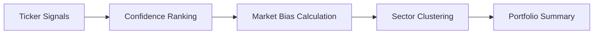

# Portfolio Intelligence Layer

The Portfolio Intelligence layer aggregates single-asset signals into a holistic, actionable view of the entire research context.

## 1. Aggregation Flow

The system scans all portfolio tickers and applies a deterministic ranking logic to surface the most robust opportunities.

## 2. Confidence-Aware Ranking

Unlike simple alphabetical lists, AlphaTrace ranks signals using a **deterministic priority queue**:
1.  **Directionality**: `LONG`/`SHORT` signals are prioritized over `NEUTRAL`.
2.  **Confidence**: Higher confidence scores (indicator alignment) are ranked first.
3.  **Tie-Breaking**: Alphabetical ticker symbols ensure stable, reproducible ordering.

## 3. Market Bias Classification

The system classifies the "Broad Consensus" of the portfolio based on signal distribution.

*   **BULLISH**: High ratio of `LONG` signals with minimal `SHORT` presence.
*   **BEARISH**: High ratio of `SHORT` signals with minimal `LONG` presence.
*   **MIXED**: Significant presence of both `LONG` and `SHORT` signals (Consensus Conflict).
*   **NEUTRAL**: Dominance of `NEUTRAL` signals across monitored tickers.

## 4. Sector Conviction (Clustering)

AlphaTrace identifies **Opportunity Zones** by grouping high-confidence signals by sector.

*   **Logic**: If multiple assets in the same sector (e.g., `Banking`) trigger high-confidence signals in the same direction, a **Cluster Alert** is generated.
*   **Insight**: Clusters provide higher conviction than isolated signals as they suggest a broad fundamental or technical movement within an industry.

## 5. Intelligence Diagnostics

The layer generates "Diagnostics" to highlight operational skews:
*   **Concentration Risk**: Alerts if signals are heavily skewed toward a single sector.
*   **Weak Consensus**: Alerts if average confidence across signals is low despite a directional bias.
*   **Regime Alignment**: Cross-references signals with the current market regime.
