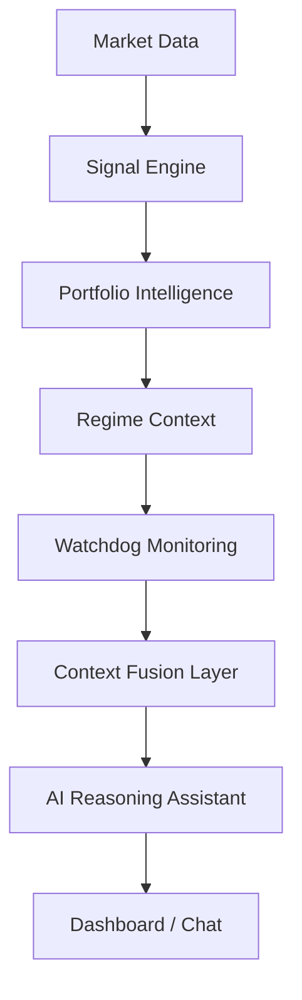

# AI Reasoning Architecture

AlphaTrace utilizes a "Quantitative-First" reasoning architecture where the Large Language Model (LLM) acts as a synthesis and orchestration layer, rather than a computational engine.

## 1. Intelligence Flow

The reasoning context is built through a deterministic pipeline that ensures the AI is grounded in quantitative fact before generating a response.

## 2. Quantitative Grounding

To minimize the risk of "hallucinations," AlphaTrace strictly separates quantitative logic from natural language generation:

*   **Quantitative Layer**: Handles all indicators, backtesting math, regime detection (HMM), and statistical anomaly detection (Watchdog). This logic is written in deterministic Python/Pandas.
*   **Context Fusion Layer**: Aggregates the outputs of the quantitative layer into structured, high-density JSON summaries.
*   **Reasoning Layer (LLM)**: Consumes the fused context to provide natural language explanations, causal analysis, and research guidance.

> [!IMPORTANT]
> The AI assistant **never** calculates RSI, Sharpe ratios, or Z-scores itself. It interprets the pre-calculated results provided in the `load_portfolio_context` payload.

## 3. Cross-Layer Context Fusion

The `load_portfolio_context` function merges multiple intelligence streams into a unified analytical summary:

*   **Regime Awareness**: Injects the current HMM state (Bull/Bear/Sideways) and persistence.
*   **Watchdog Alerts**: Injects operational risks (Sharpe decay, volatility shifts).
*   **Signal Intelligence**: Injects portfolio-wide bias, top opportunities, and sector clusters.
*   **Performance Metrics**: Injects latest returns and annualized volatility.

## 4. AI Transparency (Internal View)

AlphaTrace provides researchers with an **"Internal View"** (Escalation Context) to show exactly what data is being passed to the AI. This ensures that every AI response is auditable and tied to a specific quantitative trigger.

## 5. Reasoning Constraints

The AI layer is strictly prohibited from:
1.  **Predicting Prices**: It provides directional bias based on indicators, not price forecasts.
2.  **Autonomous Decision Making**: It suggests "Investigations" or "Audits," not "Buy/Sell" orders.
3.  **Black-Box Reasoning**: Every insight must be tied to a `causal_reason` generated by the quantitative layer.
